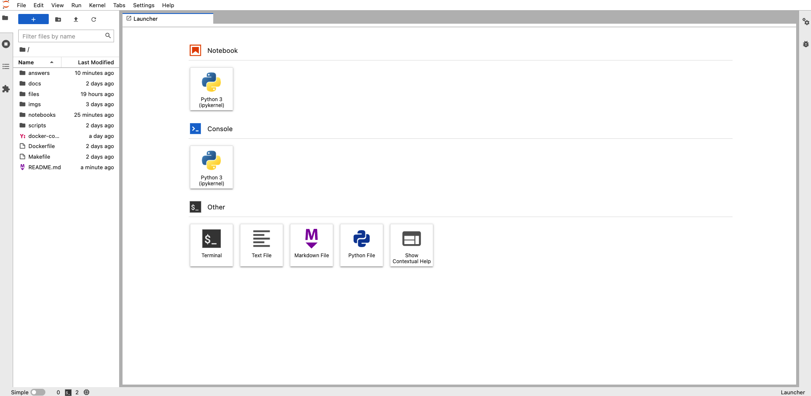

# Chatbot Analysis

This repository is the solution for a technical test given by a company during the interview process for a Senior Data Engineer position.

The test has two parts:

- we need to answer some questions about the data presented below. The questions are presented in [challenge/QUESTIONS.md](challenge/QUESTIONS.md).
- we need to provide an architecture for a generalization of this challenge. More details at [challenge/ARCHITECTURE.md](challenge/ARCHITECTURE.md)

## The Challenge

The company have developed a ChatBot that register a person's favourite Pokémon and some basic information.

We have extracted 50000 users conversations with the Chatbot and stored in a `CSV` file separeted by `;`. This file is saved in a public S3 bucket, and can be accessed in `s3://---REDACTED---`.[^1]

Each line of that file is a message with the following information:

- `Timestamp`: date & time of the message in unix epoch;
- `MessageId`: unique `uuid` for each message;
- `ConversationId`: unique `uuid` for each conversation;
- `UserId`: an identifier for the user involved in the conversation;
- `MessageText`: the message text;
- `Channel`: channel where the message was sent;
- `BotId`: an identifier for the bot involved in the conversation;
- `Source`: whether the message was sent by a `bot` or an `user`.

More information about the data can be found in the document [challenge/DATA.md](./challenge/DATA.md). 

### Note

For non-portuguese speakers, here are the Chatbot questions translated to English:
|                           **Portuguese**                           | **English**                                            |
|--------------------------------------------------------------------|--------------------------------------------------------|
| Quais são seus pokemons favoritos?                                 | What are your favourite Pokémon?                       |
| Qual seu nome?                                                     | What is your name?                                     |
| Qual a sua cidade?                                                 | Where do you live?                                     |
| Qual a sua idade?                                                  | How old are you?                                       |
| Olá, eu sou o robô de cadastro de pokemon favorito, vamos começar  | Hello, I'm the Favourite Pokémon Chatbot, let's begin! |

## The Solution

The final answer for each question can be seen in the [answers/ANSWERS.md](answers/ANSWERS.md) file. The proposed architecture can be seen in the [answers/ARCHITECTURE.md](answers/ARCHITECTURE.md) file.

If you wish to see how we obtained the answers, you would need to run two Python notebooks, both located in the `notebook` folder:

- the `data_treatment` notebook that **should run first**, since it downloads the data and do some necessary data cleaning. You need an `.env` file in this directory (see the section [.env File](#env-file)).
- the `analysis` notebook that makes use of the cleaned dataset from the `data_treatment` notebook and it is where we do all the necessary calculations to give the required answers.

To run these notebooks, we made use of a local [Spark cluster](https://spark.apache.org/) and a local [Jupyterlab server](https://jupyter.org/). This infrastructure requires `docker` and can be setup by running `make spark` (if you are running Linux) or the equivalent command `docker-compose up -d --build`.

Once the containers start, you may go to [localhost:8889](http://localhost:8889) and you will see the Jupyterlab interface:

Then, just open the `data_treatment` notebook and it should run seamlessly.

### .env File

One final and important observation is that, to run the `data_treatment` notebook, we need an `.env` file with a variable named `S3_FILE_PATH` written in it (see the `.env.example` file). We use this environment variable to load the data. The `.env` was (obviously) omitted from this repository since it contains the original location of the file.

### Design Choices

We made two deliberate choices when building the general solution for this challenge:

- the first one is obvious: we chose to use [Apache Spark](https://spark.apache.org/) as a processing engine;
- we chose to use `SQL` as much as we could.

Since Spark is cloud agnostic, this means our solution can run in `AWS`, `GCP`, other clouds or even in a on-premises cluster. Also, since `SQL` is a well-defined language, our work can be easily translated to different data platforms or data warehouses (e.g. [BigQuery](https://cloud.google.com/bigquery), [Snowflake](https://www.snowflake.com/) and, obviously, [Databricks](https://www.databricks.com/)). This means that we could use [dbt](https://www.getdbt.com/) as a framework, for example.

## System Requirements

As one can note, you need both `docker` and `docker-compose`.

[^1]: Redacted to protect the company's identity.