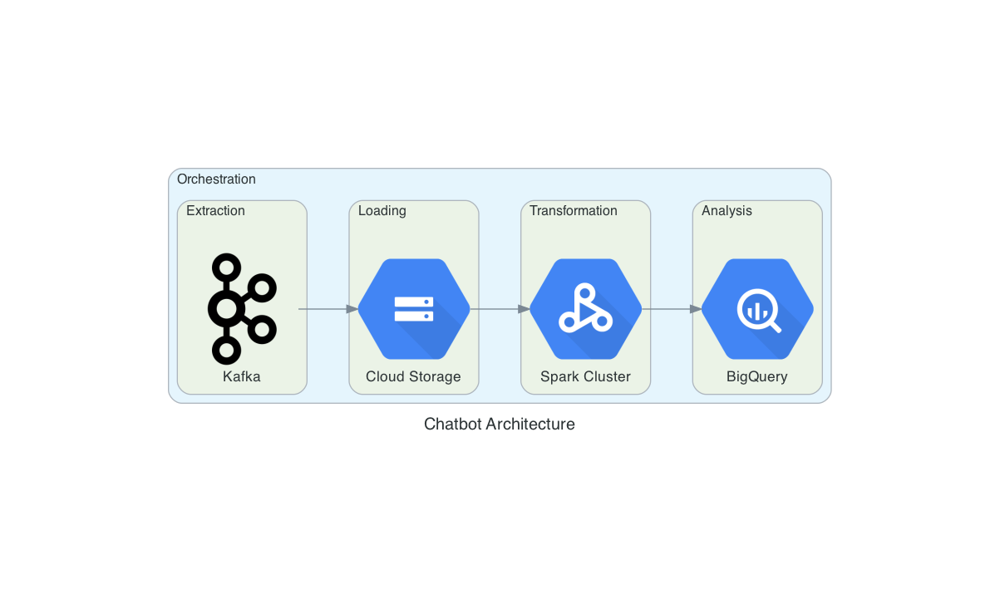
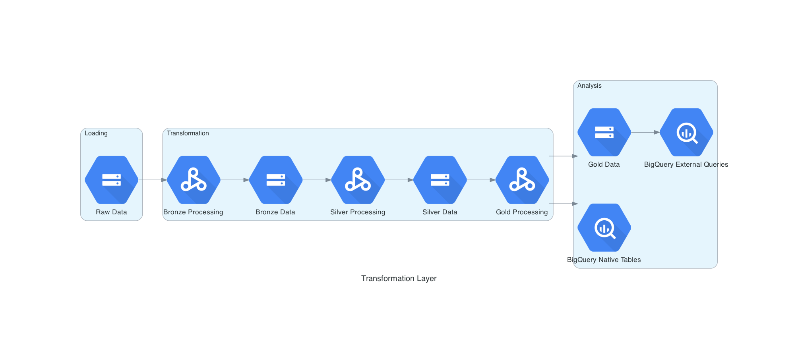

# Architecture

Whenever we talk about architecture, there are (at least) two important things to keep in mind:

- which systems are already in place (and can be reused)?
- what are the expectations & SLAs around the data?

For this exercise, let's assume that we are free to choose any system to use and our data SLA is 1 day (e.g. we do not have the need to provide 'hot' data for analysis).

With that in mind, we show below a high-level example of our proposed architecture:

The above architecture uses primarily [Google Cloud](https://cloud.google.com/) products. However, we may easily change those products if needed. What is important about the above architecture is that we have all the basic steps of a data pipeline:

- an **extraction** layer. In this layer we need a system to extract the data from the original data store (e.g. [Airbyte](https://airbyte.com/)) or a stream processing system to receive the data direclty from the Chatbot (e.g. [Apache Kafka](https://kafka.apache.org/) or [AWS Kinesis](https://aws.amazon.com/kinesis/));
- a **loading** layer. This layer is responsible for receiving all the extracted data from the original source. Common used technologies are [AWS S3](https://aws.amazon.com/s3/) and [Google Cloud Storage](https://cloud.google.com/storage);
- a **transformation** layer. For reasons that we shall discuss later, we chose to use a Spark cluster to process the data. Preferably, we would use a managed solution like [AWS EMR](https://aws.amazon.com/emr/) or [Google Cloud Dataproc](https://cloud.google.com/dataproc);
- a query engine capable of querying the data directly in the object storage (like [AWS Athena](https://aws.amazon.com/athena/) or [BigQuery External Queries](https://cloud.google.com/bigquery/docs/external-data-cloud-storage?hl=en)) or a proper data warehouse to load all the cleaned & transformed data for analysis (e.g. [BigQuery](https://cloud.google.com/bigquery) or [Snowflake](https://www.snowflake.com/));
- an **orchestration** tool to manage all the data lifecycle ([dagster](http://dagster.io) is a preferred choice of mine).

The choice for Spark as the data processing engine is not only because we used ourselves to solve the challenge: as we went through the given data, we saw that some of the necessary transformations required a more complex logic than what standard SQL could offer.

Also, we noticed that the data was 'cleaner' than it should. For example, we didn't had any misspelled (or nonexistent) Pokémon, wrong ages or even cities with critical misspells (like SaoPaulo or San Paolo). So it makes sense that, to clean *real* data coming from the Chatbot, we would need the flexibility and power given by Python functions and Spark UDFs.

One final note is that the diagram above can be quite misleading: it gives the impression that the **storage** layer and the **transformation** layer are sequential, when in reality the transformation layer uses the storage layer more than once to logically separate the data. In the next diagram we provide a more realistic view of the transformation layer (and the architecture itself), based on the [Medallion architecture](https://www.databricks.com/glossary/medallion-architecture):

As we see above, after each processing step the data is saved back into the object storage. In the end, as we discussed earlier, the data can be saved either in the object storage (to be queried by query engines like Athena) or directly into BigQuery (for faster access, since BigQuery will store the data in a way to optimize BigQuery jobs).

In this architecture, each layer has a different responsability:

- in the Bronze layer we would do some basic casting and testing (to see if the data matches with what we expect it to be). Looking back at the [/notebooks/data_treatment.ipynb](../notebooks/data_treatment.ipynb) notebook, the goal of this layer is very similar to what we did in the `Casting` and `Profiling` sections.
- the Silver layer is responsible (mostly) for feature engineering and preparing the data for aggregations. It is in this layer that we correct wrong data (SaoPaulo -> São Paulo, for example), match two or more tables from the Bronze data to create business entities, etc.
- finally, the Gold layer has the data that should be the source of truth for an enterprise. It is here that we store all the tables with the important metrics for business.
  